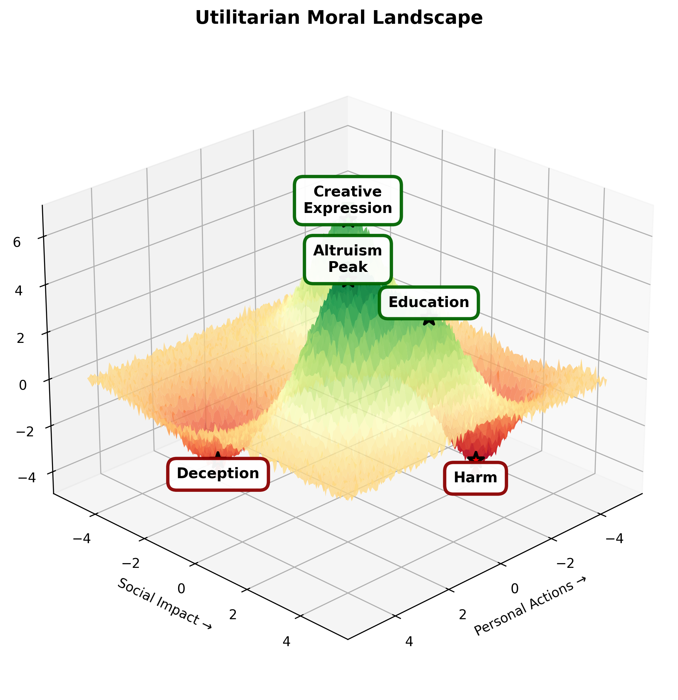

# YAML Examples for Moral Landscape Generator

This document contains example YAML files demonstrating the proposed syntax for creating moral landscapes.

---

## Example 1: Utilitarian Landscape

**Filename**: `utilitarian_landscape.yaml`

```yaml moralgraph
# Utilitarian Moral Landscape
# This landscape demonstrates utilitarian ethics with peaks representing
# actions that maximize happiness and troughs representing suffering.

landscape:
  title: "Utilitarian Moral Landscape"
  resolution: 150
  x_range: [-5, 5]
  y_range: [-5, 5]
  noise_level: 0.15
  
  axes:
    xlabel: "Personal Actions →"
    ylabel: "Social Impact →"
    zlabel: "Total Wellbeing"
  
  style:
    colormap: "RdYlGn"
    figsize: [12, 9]

peaks:
  - coords: [2, 2, 6]
    label: "Altruism\nPeak"
    label_offset: [0, 0, 0.8]
  
  - coords: [-2, -2, 5]
    label: "Creative\nExpression"
    label_offset: [0, 0, 0.8]
  
  - coords: [0, 3, 4]
    label: "Education"
    label_offset: [0, 0, 0.6]

troughs:
  - coords: [-3, 2, 4]
    label: "Harm"
    label_offset: [0, 0, -0.8]
  
  - coords: [3, -2, 3]
    label: "Deception"
    label_offset: [0, 0, -0.6]

render:
  output_file: "utilitarian_landscape.png"
  dpi: 300
  view:
    elevation: 25
    azimuth: 45
```



---

## Example 2: Civil War Moral Landscape

**Filename**: `civil_war_landscape.yaml`

```yaml  moralgraph
# American Civil War Moral Landscape
# Explores the moral dimensions of the Civil War focusing on slavery,
# Union preservation, and states' rights.

landscape:
  title: "Moral Landscape: Human Wellbeing Across Civil War Era Scenarios"
  resolution: 150
  x_range: [-5, 5]
  y_range: [-5, 5]
  noise_level: 0.2
  
  axes:
    xlabel: "Theoretical Dimension 1 (all possible states)"
    ylabel: "Theoretical Dimension 2 (all possible states)"
    zlabel: "Total Human Wellbeing"
  
  style:
    colormap: "RdYlGn"
    figsize: [14, 10]

peaks:
  - coords: [-2, 3, 9]
    label: "Peaceful Abolition\n(No War)"
  
  - coords: [0, 2.5, 7]
    label: "Gradual Abolition\n(Compensated)"
  
  - coords: [2, 2, 6.5]
    label: "Civil War →\nAbolition"

troughs:
  - coords: [0, -3.5, 9]
    label: "Slavery\nContinues"
  
  - coords: [3, -2, 5]
    label: "Prolonged\nCivil War"
  
  - coords: [-3, -2, 4.5]
    label: "Failed\nReconstruction"

render:
  output_file: "civil_war_landscape.png"
  dpi: 300
  view:
    elevation: 25
    azimuth: 45
```


---

## Example 3: Homeless Help Scenario

**Filename**: `homeless_help_landscape.yaml`

```yaml  moralgraph
# Moral Landscape: Helping a Homeless Man
# Demonstrates moral calculations about wellbeing outcomes when helping
# or not helping a homeless person in different scenarios.

landscape:
  title: "Moral Landscape: Helping a Homeless Man - Wellbeing Outcomes"
  resolution: 150
  x_range: [-5, 5]
  y_range: [-5, 5]
  noise_level: 0.2
  
  axes:
    xlabel: "Theoretical Dimension 1 (all possible states)"
    ylabel: "Theoretical Dimension 2 (all possible states)"
    zlabel: "Total Human Wellbeing"
  
  style:
    colormap: "RdYlGn"
    figsize: [14, 10]

peaks:
  - coords: [-2, 3, 9]
    label: "Help Innocent Person\n(Saves Life)"
  
  - coords: [0, 2, 5]
    label: "Person Survives\nWithout Help"
  
  - coords: [3, 2, 7]
    label: "Serial Killer\nDies Naturally"

troughs:
  - coords: [0, -3, 8]
    label: "Innocent Person\nDies (Neglect)"
  
  - coords: [3, -2, 7.5]
    label: "Serial Killer Helped\n(Murders Follow)"
  
  - coords: [-3, -2, 3]
    label: "Help Given But\nPerson Dies Anyway"

render:
  output_file: "homeless_help_landscape.png"
  dpi: 300
  view:
    elevation: 25
    azimuth: 45
```


---

## Example 4: Virtue Ethics Landscape

**Filename**: `virtue_ethics_landscape.yaml`

```yaml  moralgraph
# Virtue Ethics Landscape
# Focus on character excellence peaks and vices as troughs.

landscape:
  title: "Virtue Ethics Landscape"
  resolution: 150
  x_range: [-5, 5]
  y_range: [-5, 5]
  noise_level: 0.1
  
  axes:
    xlabel: "Practical Wisdom →"
    ylabel: "Moral Character →"
    zlabel: "Eudaimonia (Flourishing)"
  
  style:
    colormap: "coolwarm"
    figsize: [12, 9]

peaks:
  - coords: [0, 0, 7]
    label: "Wisdom\n(Phronesis)"
    label_offset: [0, 0, 1.0]
  
  - coords: [3, 1, 5]
    label: "Courage"
    label_offset: [0, 0, 0.7]
  
  - coords: [-2, 2, 5]
    label: "Temperance"
    label_offset: [0, 0, 0.7]
  
  - coords: [1, -3, 4.5]
    label: "Justice"
    label_offset: [0, 0, 0.7]

troughs:
  - coords: [-4, -2, 5]
    label: "Cowardice"
    label_offset: [0, 0, -0.8]
  
  - coords: [4, 3, 4]
    label: "Excess"
    label_offset: [0, 0, -0.7]
  
  - coords: [-1, -4, 3.5]
    label: "Injustice"
    label_offset: [0, 0, -0.6]

render:
  output_file: "virtue_ethics_landscape.png"
  dpi: 300
  view:
    elevation: 25
    azimuth: 45
```


---

## Example 5: Minimal Configuration

**Filename**: `simple_landscape.yaml`

```yaml  moralgraph
# Minimal configuration example using defaults

landscape:
  title: "Simple Moral Landscape"

peaks:
  - coords: [0, 0, 5]
    label: "Good Action"

troughs:
  - coords: [2, 2, 3]
    label: "Bad Action"

render:
  output_file: "simple_landscape.png"
  view:
    elevation: 25
    azimuth: 45
```


This will use all the default values for resolution, ranges, colors, etc.

---

## Example 6: Multi-View Rendering

**Filename**: `multi_view_landscape.yaml`

```yaml  moralgraph
# Generate multiple views from the same landscape

landscape:
  title: "Multi-View Moral Landscape"
  resolution: 150
  x_range: [-5, 5]
  y_range: [-5, 5]
  noise_level: 0.15
  
  axes:
    xlabel: "Dimension 1"
    ylabel: "Dimension 2"
    zlabel: "Moral Value"
  
  style:
    colormap: "viridis"
    figsize: [12, 9]

peaks:
  - coords: [2, 1, 6]
    label: "Peak A"
  
  - coords: [-1, -2, 5]
    label: "Peak B"

troughs:
  - coords: [1, -2, 4]
    label: "Trough A"

# Generate three different views
render:
  - output_file: "landscape_default_view.png"
    dpi: 300
    view:
      elevation: 25
      azimuth: 45
  
  - output_file: "landscape_top_view.png"
    dpi: 300
    view:
      elevation: 90
      azimuth: 0
  
  - output_file: "landscape_side_view.png"
    dpi: 300
    view:
      elevation: 10
      azimuth: 90
  
  - output_file: "landscape_angled_view.png"
    dpi: 300
    view:
      elevation: 35
      azimuth: 135
```

---

## Example 7: Custom Label Positioning

**Filename**: `custom_labels_landscape.yaml`

```yaml  moralgraph
# Demonstrates manual label positioning for precise control

landscape:
  title: "Landscape with Custom Label Positions"
  resolution: 120
  x_range: [-4, 4]
  y_range: [-4, 4]
  noise_level: 0.12
  
  axes:
    xlabel: "Action Space"
    ylabel: "Consequence Space"
    zlabel: "Value"
  
  style:
    colormap: "terrain"
    figsize: [14, 10]

peaks:
  # Peak with auto-calculated label position
  - coords: [1, 1, 5]
    label: "Auto Positioned\nPeak"
  
  # Peak with custom absolute label position
  - coords: [-1, -1, 4]
    label: "Custom Positioned\nPeak"
    label_offset: [-3, -3, 8]  # Place label far from peak
  
  # Peak with label positioned at specific coordinates
  - coords: [2, -1, 4.5]
    label: "Precisely\nPlaced"
    label_offset: [0, 0, 7]  # Directly above, high up

troughs:
  # Trough with default positioning
  - coords: [-2, 2, 3]
    label: "Standard\nTrough"
  
  # Trough with custom positioning to avoid overlap
  - coords: [2, 2, 3.5]
    label: "Repositioned\nTrough"
    label_offset: [4, 4, -2]

render:
  output_file: "custom_labels_landscape.png"
  dpi: 300
  view:
    elevation: 30
    azimuth: 60
```


---

## Example 8: Complex Real-World Scenario

**Filename**: `climate_action_landscape.yaml`

```yaml  moralgraph
# Climate Action Moral Landscape
# A complex scenario with multiple peaks and troughs

landscape:
  title: "Climate Action: Global Wellbeing Outcomes"
  resolution: 200
  x_range: [-6, 6]
  y_range: [-6, 6]
  noise_level: 0.18
  
  axes:
    xlabel: "Economic Impact ← →"
    ylabel: "Environmental Action ← →"
    zlabel: "Long-term Human Wellbeing"
  
  style:
    colormap: "RdYlGn"
    figsize: [16, 12]

peaks:
  - coords: [0, 4, 9]
    label: "Aggressive Climate Action\n+ Green Economy"
    label_offset: [0, 5, 12]
  
  - coords: [2, 2, 7]
    label: "Moderate Action\nBalanced Growth"
  
  - coords: [-3, 3, 6]
    label: "Renewable Energy\nTransition"
  
  - coords: [-1, 1, 5]
    label: "Carbon Tax\n+ Innovation"

troughs:
  - coords: [4, -3, 8]
    label: "Inaction\nClimate Catastrophe"
    label_offset: [5, -4, -10]
  
  - coords: [-4, -2, 6]
    label: "Economic Collapse\nSocial Instability"
  
  - coords: [3, 0, 4]
    label: "Inadequate Response\nSlow Degradation"
  
  - coords: [0, -4, 5]
    label: "Denial & Delay\nTipping Points"

render:
  - output_file: "climate_action_main.png"
    dpi: 300
    view:
      elevation: 25
      azimuth: 45
  
  - output_file: "climate_action_overview.png"
    dpi: 300
    view:
      elevation: 60
      azimuth: 30
```

---

## Usage Notes

### To use these YAML files:

1. **Save the YAML content** to a file with the suggested filename
2. **Run the YAML loader** (to be implemented):
   ```bash
   python moral_landscape_from_yaml.py utilitarian_landscape.yaml
   ```
3. **The script will**:
   - Parse the YAML file
   - Generate the landscape with specified coordinates
   - Apply labels at the given positions
   - Render static images if the `render` section is present
   - Save output files to the specified location

### File Organization:

```
landscapes/
├── yaml/
│   ├── utilitarian_landscape.yaml
│   ├── civil_war_landscape.yaml
│   ├── homeless_help_landscape.yaml
│   ├── virtue_ethics_landscape.yaml
│   └── climate_action_landscape.yaml
└── output/
    ├── utilitarian_landscape.png
    ├── civil_war_landscape.png
    └── ...
```

### Tips for Creating YAML Files:

1. **Start simple**: Use minimal configuration first, then add details
2. **Label positioning**: Leave `label_offset` unspecified initially, then adjust if labels overlap
3. **Coordinate planning**: Sketch your landscape on paper first to plan peak/trough positions
4. **Elevation values**: Use larger z-values for more dramatic peaks/troughs
5. **Noise level**: Start with 0.1-0.2 for realistic variation without too much clutter
6. **Resolution**: 150 is good for most cases; use 200+ for final publication-quality images
7. **Viewpoint**: elevation=25, azimuth=45 provides a good default 3D perspective

---

## Validation Checklist

Before creating a YAML file, ensure:

- [ ] All peak/trough coordinates are within the specified x_range and y_range
- [ ] Labels are concise and use `\n` for multi-line text
- [ ] The title accurately describes what the landscape represents
- [ ] Axis labels are meaningful and help interpret the visualization
- [ ] The colormap choice fits the moral domain (RdYlGn for good/bad, coolwarm for contrasts)
- [ ] Multiple peaks/troughs don't overlap excessively
- [ ] The output filename is descriptive and unique
- [ ] View angles provide a clear perspective of the landscape features

---

## Next Steps

After reviewing these examples, the next phase would involve:

1. Implementing a YAML parser/loader
2. Creating a command-line tool to process YAML files
3. Adding validation to catch common errors
4. Testing with the example files above
5. Creating documentation for end users
